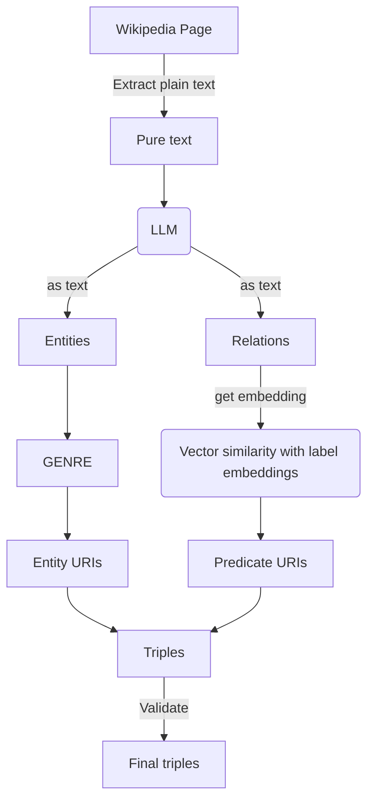

# Neural Extraction Framework @DBpedia - GSoC 2025

|   Project Details     |                                                                                                                                                                                               |
|-------------|-----------------------------------------------------------------------------------------------------------------------------------------------------------------------------------------------|
| GSoC Project | [Neural Extraction Framework GSoC'25 @DBpedia](https://summerofcode.withgoogle.com/myprojects/details/uQUHx6jo)                                                                           |
| Contributor | [Gandharva Naveen](https://www.linkedin.com/in/gandharva-naveen)                                                                                                                        |
| Mentors | [Tommaso Soru](), [Abdulsobur Oyewale](), [Diego Moussallem](), [Ronit Banerjee]() |
| Blogs | [GSoC-2025 Gandharva Naveen](https://github.com/Gnav3852/neural-extraction-framework/wiki/)                                                                                                                                   |

### What is Neural Extraction Framework?

The Neural Extraction Framework (NEF) is a system designed to extract structured relational knowledge—called RDF triples—directly from unstructured text. While traditional approaches like [DBpedia](https://www.dbpedia.org/) rely on Wikipedia infoboxes to build knowledge graphs, NEF focuses on uncovering the hidden relationships embedded in natural language. It uses large language models (LLMs), embedding-based retrieval, and ontology alignment to identify entities, match predicates to a known ontology (like DBpedia), and produce machine-readable [relational triples](https://en.wikipedia.org/wiki/Semantic_triple) such as (Albert Einstein — award — Nobel Prize in Physics).

The goal of NEF is to move beyond static, infobox-based extraction toward a dynamic, intelligent pipeline that continuously learns and adapts. By integrating embedding search, Redis grounding, and LLM reasoning, NEF can both expand existing knowledge graphs and validate extracted information through similarity scoring and ontology mapping. In essence, NEF bridges text and knowledge representation—transforming open text into structured, queryable data that allows machines to “understand the world, one triple at a time.”


### Code structure
All directories/files have detailed instruction about how to use them in the git wiki posts.
```
📦GSoC25/NEF
 ┣ 📂ground_truth
 ┣ 📂test
 ┣ 📂Bench.py
 ┣ 📂Embeddings.py
 ┣ 📂Webscrape.py
 ┣ 📂NEF.py
```

### Installations 
Run the command below to install all requirements of the project at once(preferably in a virtual environment).
```
!pip install -r requirements.txt
```

### Run from command line

You need to precompute the DBpedia embeddings before running the NEF.
```
!python Emeddings.py
```
You can also just run a test file 
```
python end-2-end-use.py --text_filepath "joe_biden_abstract.txt" --v 0 --save_filename "triples_from_file.csv"
```

[//]: # (### Example of using the command line utility:)

[//]: # ()
[//]: # (https://github.com/dbpedia/neural-extraction-framework/assets/84656834/306dc5ae-ff43-404c-bac3-5f77a6ffd3a9)


### Project workflow


### Future scope
This project has been successful in developing a new technique of entity-relation extraction in the field of knowledge graph, thereby improving the previous end-2-end pipeline for triple extraction. But there is are still room for improvement towards the task of entity linking.
